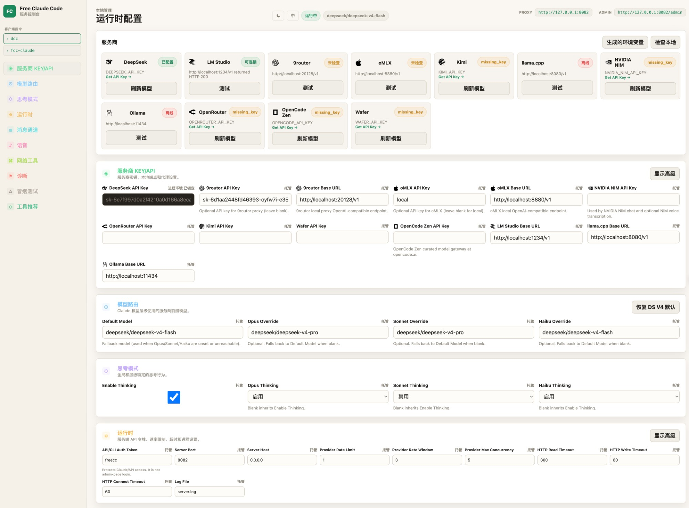
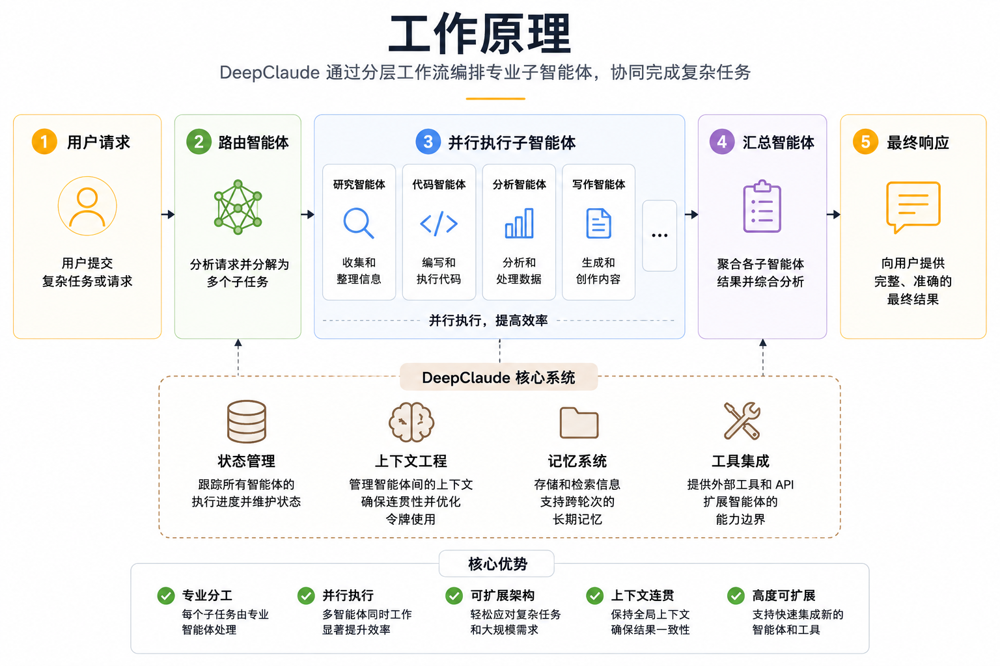

<div align="center">

# 🤖 Deep Claude Code

通过你自己的 Anthropic 兼容代理，使用 Claude Code CLI、VS Code、JetBrains ACP 或聊天机器人。

[](https://opensource.org/licenses/MIT)
[](https://www.python.org/downloads/)
[](https://github.com/astral-sh/uv)
[](https://github.com/jasonet/deep-claude/actions/workflows/tests.yml)
[](https://pypi.org/project/ty/)
[](https://github.com/astral-sh/ruff)
[](https://github.com/Delgan/loguru)

Deep Claude Code 把 Claude Code 的 Anthropic Messages API 流量路由到 **DeepSeek 优先**，同时支持 NVIDIA NIM、Kimi、Wafer、OpenRouter、LM Studio、llama.cpp、Ollama、OpenCode Zen、9routor 和 oMLX。默认面向 DeepSeek V4 设计，零配置启动。

<div align="center">
  
</div>

[快速开始](#快速开始) · [服务商](#选一个服务商) · [客户端](#接入-claude-code) · [配置参考](#配置参考) · [开发](#开发)

</div>

<div align="center">
  
</div>

## 你能得到什么

- Claude Code 的 Anthropic API 调用即插即用代理
- 十个服务商后端：DeepSeek、NVIDIA NIM、Kimi、Wafer、OpenRouter、LM Studio、llama.cpp、Ollama、OpenCode Zen 和 9routor
- **支持 9routor 本地路由代理**，便于在受限网络下连通多家上游
- 按模型分级路由：Opus、Sonnet、Haiku 与回退流量可分别走不同服务商
- 通过代理的 `/v1/models` 端点原生支持 Claude Code 的 `/model` 选择器（Claude Code 需开启 Gateway 模型发现；见 [模型选择器](#模型选择器)）
- 流式传输、工具调用、思考/推理块处理，本地请求优化
- 可选的 Discord 或 Telegram 机器人包装，用于远程编码会话
- 通过 VSCode 扩展可选用量统计
- 通过本地 Whisper 或 NVIDIA NIM 提供可选语音转写
- 本地 **管理后台**位于 `/admin`，编辑代理设置、校验改动、检测服务商（仅限回环访问）

## 快速开始

### 1. 安装最新版 [Claude Code](https://code.claude.com/docs/en/overview)

```bash
npm install -g @anthropic-ai/claude-code
```

### 2. 安装运行时

安装最新版 [uv](https://docs.astral.sh/uv/getting-started/installation/) 和 Python 3.14。

macOS/Linux：

```bash
curl -LsSf https://astral.sh/uv/install.sh | sh
uv self update
uv python install 3.14
```

Windows PowerShell：

```powershell
powershell -ExecutionPolicy ByPass -c "irm https://astral.sh/uv/install.ps1 | iex"
uv self update
uv python install 3.14
```

### 3. 获取 DeepSeek API Key

在 [platform.deepseek.com/api_keys](https://platform.deepseek.com/api_keys) 获取免费或付费 API key。

充几美元即可；DeepSeek 价格非常低廉。

### 4. 一键安装

```bash
uv tool install --force git+https://github.com/jasonet/deep-claude.git
```

使用同一条命令即可更新到最新版本。

### 5. 启动代理

```bash
dc-server
```

启动后浏览器自动打开管理后台，粘贴你的 DeepSeek Key：

```text
Server URL: http://127.0.0.1:8082
Admin UI:   http://127.0.0.1:8082/admin
```

### 6. 粘贴你的 DeepSeek API Key

打开 **管理后台**（`http://127.0.0.1:8082/admin`）。

把 key 粘贴到 **DeepSeek API Key**，依次点 **Validate** → **Apply**。

### 7. 启动 Claude Code

```bash
dcc
# 或
dc-claude
```

两条命令都会通过本地代理启动 Claude Code。在你的项目目录中运行它们。

## 选一个服务商

挑一个服务商，在管理后台填它的 key 或本地 URL，把 `MODEL` 设置成带服务商前缀的模型 slug。`MODEL` 是回退值。`MODEL_OPUS`、`MODEL_SONNET`、`MODEL_HAIKU` 可以覆盖 Claude Code 各个模型层级的路由。

<a id="nvidia-nim-provider"></a>

### 1. [NVIDIA NIM](https://build.nvidia.com/)

在 [build.nvidia.com/settings/api-keys](https://build.nvidia.com/settings/api-keys) 获取 key。

在管理后台填到 `NVIDIA_NIM_API_KEY`。默认 `MODEL` 是 `nvidia_nim/z-ai/glm4.7`。

在 [build.nvidia.com](https://build.nvidia.com/explore/discover) 浏览模型。

### 2. [Kimi](https://platform.moonshot.ai/)

在 [platform.moonshot.ai/console/api-keys](https://platform.moonshot.ai/console/api-keys) 获取 key。

在管理后台填到 `KIMI_API_KEY`，然后把 `MODEL` 设置成 Kimi slug，例如 `kimi/kimi-k2.5`。

在 [platform.moonshot.ai](https://platform.moonshot.ai) 浏览模型。

### 3. [Wafer](https://wafer.ai/)

在 [wafer.ai](https://wafer.ai) 获取 key。在管理后台填到 `WAFER_API_KEY`，然后把 `MODEL` 设置成 Wafer Pass 模型，例如 `wafer/DeepSeek-V4-Pro`。

常见示例：

- `wafer/DeepSeek-V4-Pro`
- `wafer/MiniMax-M2.7`
- `wafer/Qwen3.5-397B-A17B`
- `wafer/GLM-5.1`

该服务商使用 Wafer 的 Anthropic 兼容端点 `https://pass.wafer.ai/v1/messages`。

### 4. [OpenRouter](https://openrouter.ai/)

在 [openrouter.ai/keys](https://openrouter.ai/keys) 获取 key。

在管理后台填到 `OPENROUTER_API_KEY`，然后把 `MODEL` 设置成 OpenRouter slug，例如 `open_router/stepfun/step-3.5-flash:free`。

浏览[全部模型](https://openrouter.ai/models)或[免费模型](https://openrouter.ai/collections/free-models)。

### 5. [DeepSeek](https://platform.deepseek.com/)

在 [platform.deepseek.com/api_keys](https://platform.deepseek.com/api_keys) 获取 key。

在管理后台填到 `DEEPSEEK_API_KEY`，然后把 `MODEL` 设置成 DeepSeek slug，例如 `deepseek/deepseek-chat`。

该服务商使用 DeepSeek 的 Anthropic 兼容端点，**不是** OpenAI 风格的 chat-completions 端点。

### 6. [LM Studio](https://lmstudio.ai/)

启动 LM Studio 的本地服务器并加载一个模型。在管理后台保留或更新 `LM_STUDIO_BASE_URL`，然后把 `MODEL` 设置成 LM Studio 显示的模型标识，加 `lmstudio/` 前缀。

工具调用相关的工作流推荐使用支持工具的模型。

### 7. [llama.cpp](https://github.com/ggml-org/llama.cpp)

启动 `llama-server`，提供 Anthropic 兼容的 `/v1/messages` 端点，并预留足够的上下文供 Claude Code 请求使用。

在管理后台保留或更新 `LLAMACPP_BASE_URL`，然后把 `MODEL` 设置成本地模型 slug，加 `llamacpp/` 前缀。

本地编码模型的上下文长度很重要。若 llama.cpp 对正常的 Claude Code 请求返回 HTTP 400，请增大 `--ctx-size` 并确认所选模型/服务端编译版本支持所需功能。

### 8. [Ollama](https://ollama.com/)

运行 Ollama 并拉一个模型：

```bash
ollama pull llama3.1
ollama serve
```

在管理后台保留或更新 `OLLAMA_BASE_URL`，把 `MODEL` 设置成 `ollama list` 显示的同样 tag，加 `ollama/` 前缀。

`OLLAMA_BASE_URL` 是 Ollama 服务器根地址，**不要**追加 `/v1`。模型 slug 示例：`ollama/llama3.1` 和 `ollama/llama3.1:8b`。

### 9. [OpenCode Zen](https://opencode.ai/)

在 [opencode.ai/auth](https://opencode.ai/auth) 获取 API key。

在管理后台填到 `OPENCODE_API_KEY`，然后把 `MODEL` 设置成 OpenCode Zen 模型 slug，例如 `opencode/gpt-5.3-codex`。

OpenCode Zen 是一个精选的模型网关，通过单一 API key 和 OpenAI 兼容端点 `https://opencode.ai/zen/v1` 提供来自 Anthropic、OpenAI、Google、DeepSeek 等多家厂商的模型。

在 [opencode.ai](https://opencode.ai) 浏览可用模型。

### 10. 按模型层级混搭服务商

通过在管理后台分别设置 `MODEL_OPUS`、`MODEL_SONNET`、`MODEL_HAIKU`，每个模型层级可以使用不同服务商。某一层留空则继承 `MODEL`。

举例：Opus 路由到 `nvidia_nim/moonshotai/kimi-k2.5`，Sonnet 走 `open_router/deepseek/deepseek-r1-0528:free`，Haiku 走 `lmstudio/unsloth/GLM-4.7-Flash-GGUF`，回退 `MODEL` 保持 `opencode/gpt-5.3-codex`。

## 接入 Claude Code

### 1. Claude Code CLI

终端使用推荐已安装的启动器：

```bash
dcc 或 dc-claude
```

工作时保持 `dc-server` 运行。管理后台负责管理代理配置、在运行时设置变更时重启服务，`dc-claude` 每次启动都会读取管理后台维护的端口和 auth token。

### 2. VS Code 扩展

打开设置，搜索 `claude-code.environmentVariables`，选择 **Edit in settings.json**，添加：

```json
"claudeCode.environmentVariables": [
  { "name": "ANTHROPIC_BASE_URL", "value": "http://localhost:8082" },
  { "name": "ANTHROPIC_AUTH_TOKEN", "value": "dc-auth" },
  { "name": "CLAUDE_CODE_ENABLE_GATEWAY_MODEL_DISCOVERY", "value": "1" }
]
```

重新加载扩展。如果扩展显示登录页面，选择一次 Anthropic Console 路径即可；环境变量生效后，本地代理仍然会接管模型流量。

### 3. JetBrains ACP

编辑已安装的 Claude ACP 配置：

- Windows：`C:\Users\%USERNAME%\AppData\Roaming\JetBrains\acp-agents\installed.json`
- Linux/macOS：`~/.jetbrains/acp.json`

为 `acp.registry.claude-acp` 设置 env：

```json
"env": {
  "ANTHROPIC_BASE_URL": "http://localhost:8082",
  "ANTHROPIC_AUTH_TOKEN": "dc-auth",
  "CLAUDE_CODE_ENABLE_GATEWAY_MODEL_DISCOVERY": "1"
}
```

改完之后重启 IDE。

### 4. 模型选择器

<div align="center">
  
</div>

## 可选集成

### 1. Discord 和 Telegram 机器人

机器人包装在远程运行 Claude Code 会话，流式推送进度，支持按回复分支的会话，并能停止或清空任务。

Discord 最小配置：

```dotenv
MESSAGING_PLATFORM="discord"
DISCORD_BOT_TOKEN="your-discord-bot-token"
ALLOWED_DISCORD_CHANNELS="123456789"
CLAUDE_WORKSPACE="./agent_workspace"
ALLOWED_DIR="C:/Users/yourname/projects"
```

在 [Discord 开发者门户](https://discord.com/developers/applications)创建机器人，启用 Message Content Intent，并以读/发/查历史权限邀请它进群。

Telegram 最小配置：

```dotenv
MESSAGING_PLATFORM="telegram"
TELEGRAM_BOT_TOKEN="123456789:ABC..."
ALLOWED_TELEGRAM_USER_ID="your-user-id"
CLAUDE_WORKSPACE="./agent_workspace"
ALLOWED_DIR="C:/Users/yourname/projects"
```

去 [@BotFather](https://t.me/BotFather) 拿 token，去 [@userinfobot](https://t.me/userinfobot) 查你的用户 ID。

常用命令：

- `/stop` 取消任务；回复某条任务消息只停那个分支
- `/clear` 重置会话；回复消息只清那个分支
- `/stats` 查看会话状态

### 2. 语音笔记

语音笔记在 Discord 和 Telegram 上都可用。选一个后端：

```bash
uv sync --extra voice_local
uv sync --extra voice
uv sync --extra voice --extra voice_local
```

```dotenv
VOICE_NOTE_ENABLED=true
WHISPER_DEVICE="cpu"          # cpu | cuda | nvidia_nim
WHISPER_MODEL="base"
HF_TOKEN=""
```

`WHISPER_DEVICE="nvidia_nim"` 配合 `voice` extra 和 `NVIDIA_NIM_API_KEY` 即可使用 NVIDIA 托管转写。

## 配置参考

[`.env.example`](.env.example) 是变量的权威清单。下面列出大多数用户最常改的几节。

### 1. 手动 `.env` 配置（无 UI）

仅在你偏好文件配置或运行无头模式时使用。首次配置建议优先用管理后台。

```bash
cp .env.example .env
```

NVIDIA NIM 示例：

```dotenv
NVIDIA_NIM_API_KEY="nvapi-your-key"
MODEL="nvidia_nim/z-ai/glm4.7"
ANTHROPIC_AUTH_TOKEN="dc-auth"
```

配置优先级：仓库 `.env`，然后 `~/.config/deep-claude/.env`，最后是 `DCC_ENV_FILE`（如已设置）。`ANTHROPIC_AUTH_TOKEN` 可以是任意本地 secret；把同一个值传给 Claude Code。

### 2. 模型路由

```dotenv
MODEL="nvidia_nim/z-ai/glm4.7"
MODEL_OPUS=
MODEL_SONNET=
MODEL_HAIKU=
ENABLE_MODEL_THINKING=true
ENABLE_OPUS_THINKING=
ENABLE_SONNET_THINKING=
ENABLE_HAIKU_THINKING=
```

分层级值留空则继承回退值。思考覆盖留空则继承 `ENABLE_MODEL_THINKING`。

### 3. 服务商 Key 和 URL

```dotenv
NVIDIA_NIM_API_KEY=""
OPENROUTER_API_KEY=""
DEEPSEEK_API_KEY=""
WAFER_API_KEY=""
OPENCODE_API_KEY=""
LM_STUDIO_BASE_URL="http://localhost:1234/v1"
LLAMACPP_BASE_URL="http://localhost:8080/v1"
OLLAMA_BASE_URL="http://localhost:11434"
```

每个服务商独立代理设置：

```dotenv
NVIDIA_NIM_PROXY=""
OPENROUTER_PROXY=""
LMSTUDIO_PROXY=""
LLAMACPP_PROXY=""
WAFER_PROXY=""
OPENCODE_PROXY=""
```

### 4. 限流和超时

```dotenv
PROVIDER_RATE_LIMIT=1
PROVIDER_RATE_WINDOW=3
PROVIDER_MAX_CONCURRENCY=5
HTTP_READ_TIMEOUT=120
HTTP_WRITE_TIMEOUT=10
HTTP_CONNECT_TIMEOUT=10
```

免费托管服务商建议把限制调低；本地服务商在机器性能足够时可以提升并发。

### 5. 安全和诊断

```dotenv
ANTHROPIC_AUTH_TOKEN=
LOG_RAW_API_PAYLOADS=false
LOG_RAW_SSE_EVENTS=false
LOG_API_ERROR_TRACEBACKS=false
LOG_RAW_MESSAGING_CONTENT=false
LOG_RAW_CLI_DIAGNOSTICS=false
LOG_MESSAGING_ERROR_DETAILS=false
```

原始日志开关可能暴露 prompt、工具参数、路径以及模型输出。仅在本地调试时打开。

结构化 TRACE 行带 `"trace": true`、`stage`、`event`、`source` 等字段，并附带跟踪 Claude Code 流程所需的会话上下文。看起来像凭据的字典键（例如嵌套在结构化负载里的 `api_key` / `authorization` 值）会被脱敏；但你输入到 prompt 里的任意自然语言文本仍可能原样出现。

### 6. 本地 Web 工具

```dotenv
ENABLE_WEB_SERVER_TOOLS=true
WEB_FETCH_ALLOWED_SCHEMES=http,https
WEB_FETCH_ALLOW_PRIVATE_NETWORKS=false
```

这些工具会从代理发出对外 HTTP 请求。除非你在受控的实验环境，否则别打开私有网络访问。

## 工作原理

<div align="center">
  
</div>

关键组件：

- FastAPI 暴露 Anthropic 兼容路由，包括 `/v1/messages`、`/v1/messages/count_tokens`、`/v1/models`
- 模型路由把 Claude 模型名解析为 `MODEL_OPUS`、`MODEL_SONNET`、`MODEL_HAIKU` 或 `MODEL`
- NIM、OpenCode Zen 使用 OpenAI 风格 chat 流式，再转换为 Anthropic SSE
- Wafer、OpenRouter、DeepSeek、LM Studio、llama.cpp 和 Ollama 使用 Anthropic Messages 风格的传输
- 代理把 thinking 块、工具调用、token 用量元数据和服务商错误统一为 Claude Code 期望的形态
- 请求优化在本地直接回复 Claude Code 的琐碎探测请求，节省延迟和配额

## 开发

### 1. 项目结构

```text
deep-claude/
├── server.py              # ASGI 入口
├── api/                   # FastAPI 路由、服务层、路由表、优化
├── core/                  # 共享 Anthropic 协议辅助和 SSE 工具
├── providers/             # 服务商传输、注册表、限流
├── messaging/             # Discord/Telegram 适配、会话、语音
├── cli/                   # 包入口和 Claude 进程管理
├── config/                # 设置、服务商目录、日志
└── tests/                 # 单元和契约测试
```

### 2. 从源代码运行

如果你在做开发或想直接从 checkout 运行：

```bash
git clone https://github.com/jasonet/deep-claude.git
cd deep-claude
uv run uvicorn server:app --host 0.0.0.0 --port 8082
```

### 3. 命令

```bash
uv run ruff format
uv run ruff check
uv run ty check
uv run pytest
```

推送前依次跑这几条。CI 会强制同样的检查。

### 4. 包脚本

`pyproject.toml` 安装：

- `dc-server`：用配置的 host 和 port 启动代理
- `dc-init`：可选的文件配置骨架到 `~/.config/deep-claude/.env`
- `dcc`：用配置的本地代理 URL 启动 Claude Code（DeepSeek 优先）
- `dc-claude`：等同于 `dcc`；通过代理启动 Claude Code
- `deep-claude`：`dc-server` 的兼容别名

### 5. 扩展

- 添加 OpenAI 兼容的服务商时，继承 `OpenAIChatTransport`
- 添加 Anthropic Messages 服务商时，继承 `AnthropicMessagesTransport`
- 在 `config.provider_catalog` 注册服务商元数据，在 `providers.registry` 接好工厂
- 添加消息平台时，在 `messaging/` 实现 `MessagingPlatform` 接口

## DeepSeek 相关开源工具推荐

下面这些开源项目与本仓库属于同一生态，可与 DeepSeek / Claude Code 搭配使用。点击名称跳转到对应 GitHub 仓库。

| 项目 | 用途 |
|---|---|
| [Claude Code Haha](https://github.com/NanmiCoder/cc-haha) | 为 Claude Code 提供可插拔的增强能力与实用工具 |
| [DeepSeek-TUI](https://github.com/Hmbown/DeepSeek-TUI) | DeepSeek API 终端界面客户端 |
| [claude-desktop-deepseek](https://github.com/hustlxc/claude-desktop-deepseek) | 使用 DeepSeek 后端的 Claude Desktop |
| [deepclaude](https://github.com/aattaran/deepclaude) | DeepSeek + Claude 双模型代理 |
| [Ghostty](https://github.com/ghostty-org/ghostty) | 快速、功能丰富的终端模拟器 |
| [cmux](https://github.com/manaflow-ai/cmux) | Claude Code 会话管理器 |
| [yazi](https://github.com/sxyazi/yazi) | 极速终端文件管理器 |

> 上述清单同步显示在管理后台的「工具推荐」区块。

## 许可

MIT License。详见 [LICENSE](LICENSE)。

## Star History

<div align="center">
  <a href="https://star-history.com/#jasonet/deep-claude&Date">
    <picture>
      <source media="(prefers-color-scheme: dark)" srcset="https://api.star-history.com/svg?repos=jasonet/deep-claude&type=Date&theme=dark">
      <source media="(prefers-color-scheme: light)" srcset="https://api.star-history.com/svg?repos=jasonet/deep-claude&type=Date">
      
    </picture>
  </a>
</div>
